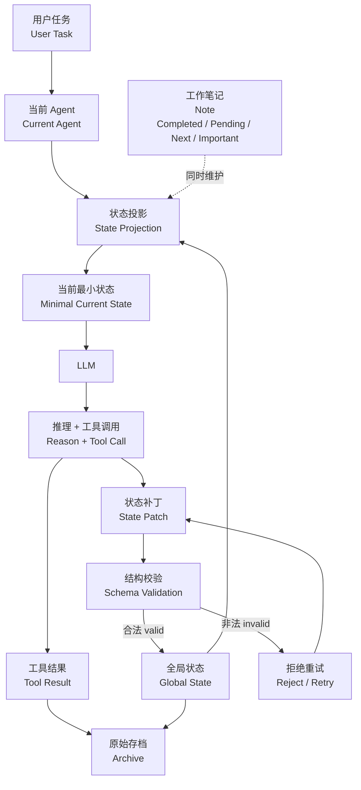
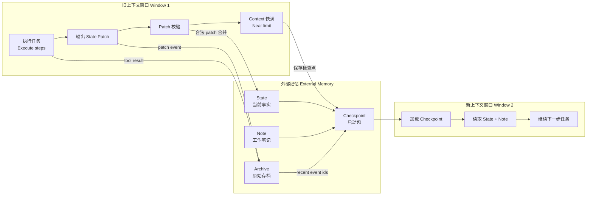
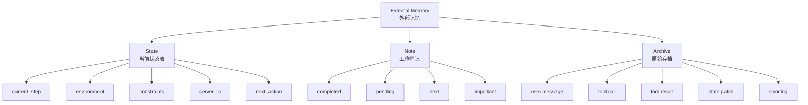
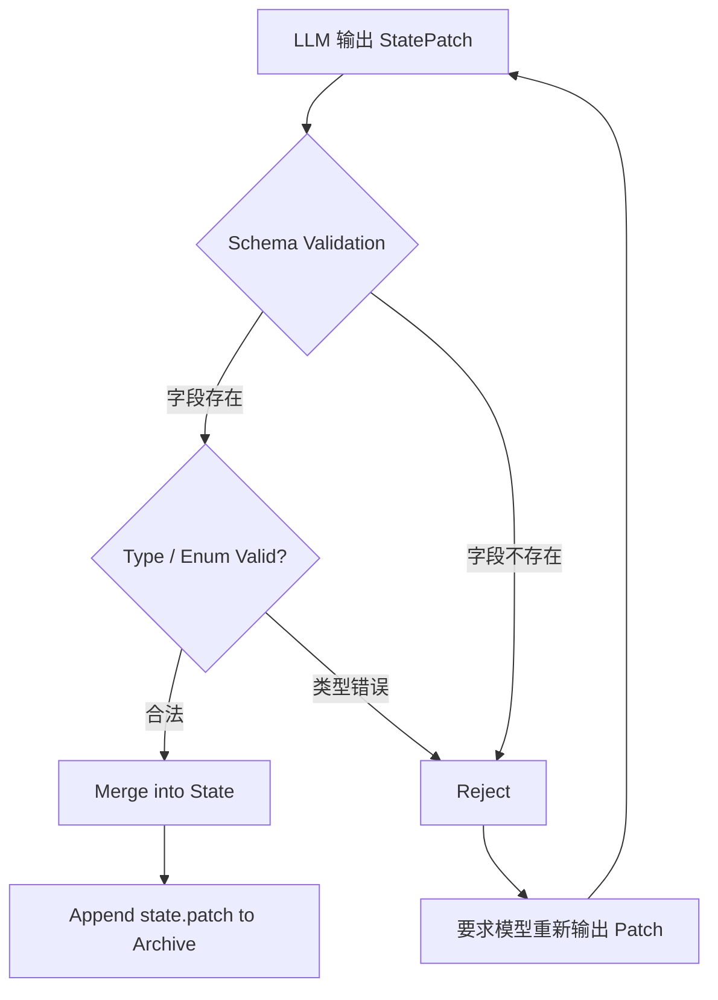
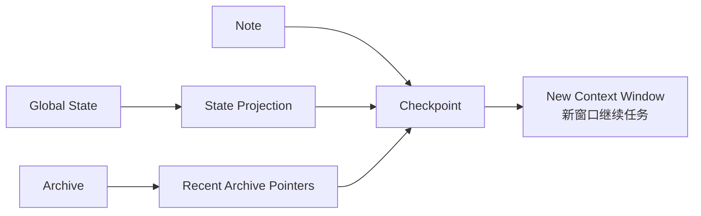
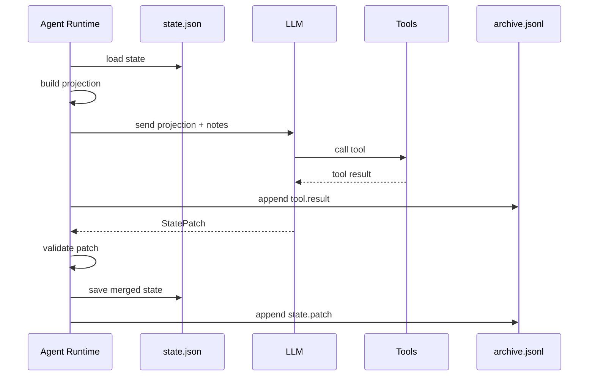
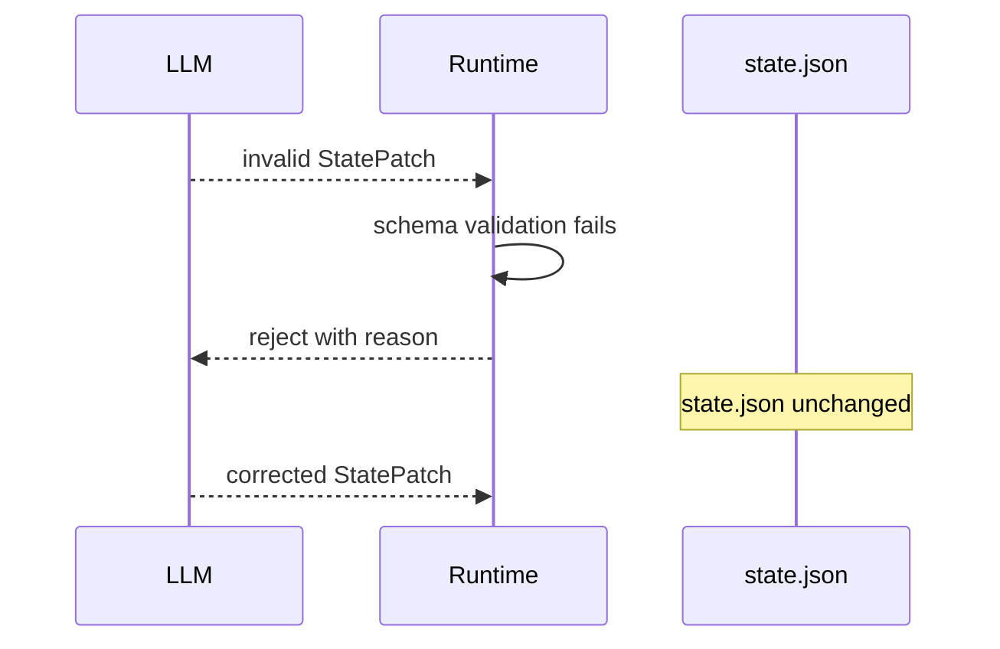

# Hard Context Cutover

这是一个“长程 Agent 续航机制”的参考实现。它演示的不是如何把历史聊天压缩得更短，而是如何把 Agent 下一步需要的事实显式维护在外部状态里，然后在上下文窗口快满时做硬切换。

一句话概括：

> 历史不是状态，记忆也不是上下文。长程 Agent 应该依赖结构化的当前状态继续执行，而不是反复阅读和摘要自己的完整历史。

## 先看架构图

这个项目的核心不是“把旧上下文压得更短”，而是把长程任务拆成三层：

- 当前窗口：负责推理和工具调用。
- 外部状态：负责保存当前事实、工作笔记和原始证据。
- 新窗口：只加载足够继续执行的当前状态。

### 总体循环



### 旧窗口到新窗口



### 外部记忆分层



### Patch 提交流程



### Checkpoint 内容



仓库里还有一个可视化页面：

```text
visualizer/index.html
```

这个页面不需要构建工具，直接用浏览器打开即可。

## 解决的问题

很多长程 Agent 会采用这种模式：

```text
历史越来越长
  ↓
做一次 Summary
  ↓
Summary + 最近消息继续执行
```

这个办法适合普通对话，但不适合作为长任务的核心状态机制。因为摘要是有损压缩，容易丢掉后续执行最需要的事实，例如：

- 文件路径、配置项、接口返回码
- 用户明确给出的约束
- 当前执行到第几步
- 已经失败过的方案
- 工具调用返回的关键字段
- 不能重复或不能覆盖的操作

本项目采用另一种方式：

```text
旧上下文窗口
  ↓
保存 State / Note / Archive
  ↓
生成 Checkpoint
  ↓
硬切到新上下文窗口
  ↓
只加载足够继续执行的状态投影
```

## 核心概念

这套机制里，最重要的区分是：

```text
Context 只是模型当前工作台。
State 才是任务当前事实。
Archive 才是历史原始证据。
```

模型可以忘掉旧窗口，但系统不能忘掉当前事实。所以本项目让事实离开上下文窗口，进入外部存储。

### State

`State` 是 Agent 的“当前事实表”。它保存下一步决策必须知道的结构化事实。

在本项目中，State 存储为 JSON 文件：

```text
.agent_state/state.json
```

默认结构定义在 [src/hard_context_cutover/store.py](/Users/huangxuan/Documents/ChatGPT/长程agent上下午处理机制/src/hard_context_cutover/store.py)：

```json
{
  "task": {
    "name": "",
    "current_step": 0,
    "status": "new",
    "environment": "staging",
    "database": "",
    "completed": [],
    "pending": [],
    "next": ""
  },
  "infra": {
    "server_ip": ""
  },
  "constraints": ["禁止修改 production"],
  "notes": {
    "completed": [],
    "pending": [],
    "next": [],
    "important": []
  }
}
```

State 适合保存：

- 当前任务名
- 当前步骤
- 任务状态
- 运行环境
- 已完成事项
- 待办事项
- 下一步动作
- 关键基础设施信息
- 用户约束

State 不适合保存完整历史消息、大段日志、模型推理过程或所有工具输出。

在代码里，State 由 `JsonStateStore` 负责读写：

- `load()`: 从 `state.json` 读取状态；如果不存在，就返回默认状态。
- `save(state)`: 把新状态写回 `state.json`。

这个设计故意很朴素，因为重点不是数据库选型，而是状态边界：State 必须小、准、结构化。

### Note

`Note` 是工作笔记，用来帮助新窗口快速恢复任务语境。

当前实现里，Note 作为 State 的一部分存在：

```json
{
  "notes": {
    "completed": ["服务器已部署到 staging。"],
    "pending": ["Nginx 尚未配置。"],
    "next": ["验证 HTTPS。"],
    "important": ["用户明确要求不能修改 production。"]
  }
}
```

Note 和 State 的区别：

- State 记录“现在是什么”
- Note 记录“为什么这样、哪些提醒值得保留”

例如：

```text
State:
task.current_step = 73
infra.server_ip = 10.0.0.8

Note:
用户明确要求不能修改 production
之前方案 A 因权限不足失败
下一步先验证 HTTPS
```

在更复杂的系统里，可以把 Note 独立存成：

```text
.agent_state/notes.json
```

本项目为了让原型更简单，把 Note 放在 `state.json` 里，因为它在窗口恢复时通常会被一起加载。

如果系统变复杂，可以把 Note 拆出去。比如：

```text
.agent_state/
  state.json
  notes.json
  archive.jsonl
```

但拆不拆不是关键。关键是 Note 不应该替代 State。Note 可以比较自然语言化，State 应该更像数据库字段。

### Archive

`Archive` 是原始档案馆。它保存可追溯的原始事件，不参与每一步默认上下文。

在本项目中，Archive 存储为 JSONL 文件：

```text
.agent_state/archive.jsonl
```

JSONL 的意思是一行一个 JSON 事件。示例：

```json
{"id":"9917ad68-62b7-42e2-b289-498d46436b2c","kind":"state.patch","payload":{"source":"llm","patch":{"set":{"task.current_step":73},"unset":[],"append":{"task.completed":["服务器部署完成"]}}},"ts":"2026-09-12T07:40:38.621136+00:00"}
```

Archive 适合保存：

- 用户原话
- Assistant 决策
- Tool Call
- Tool Result
- API Response
- Error Log
- State Patch
- 文件修改记录

为什么使用 JSONL：

- 适合追加写入
- 不需要每次重写大文件
- 长任务里可以保存很多事件
- 后续容易接入检索、索引或向量数据库

Archive 的实现位于 [src/hard_context_cutover/archive.py](/Users/huangxuan/Documents/ChatGPT/长程agent上下午处理机制/src/hard_context_cutover/archive.py)。

Archive 的核心 API 是：

```python
event_id = archive.append("tool.result", {"ok": True})
events = archive.tail(10)
```

它返回 `event_id`，是为了后续可以在 Checkpoint 里保存指针。新窗口默认不读完整 Archive，只拿最近事件或相关事件的指针。

### StatePatch

`StatePatch` 是模型每轮执行后提交的状态补丁。

模型不应该直接输出完整新 State，而应该只描述本轮发生的最小变化：

```json
{
  "set": {
    "task.current_step": 73,
    "infra.server_ip": "10.0.0.8"
  },
  "append": {
    "task.completed": ["服务器部署完成"]
  },
  "unset": []
}
```

支持三种操作：

- `set`: 设置字段值
- `append`: 向列表字段追加项目
- `unset`: 删除字段

这样做的好处是最小状态变更。假设 State 有 50 个字段，但这一轮只改变 2 个字段，模型就只能碰这 2 个字段，降低误删、幻觉和覆盖正确状态的风险。

StatePatch 的实现位于 [src/hard_context_cutover/patch.py](/Users/huangxuan/Documents/ChatGPT/长程agent上下午处理机制/src/hard_context_cutover/patch.py)。

Patch 的合并顺序是：

```text
1. validate patch shape
2. validate field names
3. validate values by schema
4. copy old state
5. apply set
6. apply append
7. apply unset
8. validate full new state
9. save
10. append patch event to archive
```

注意：程序会先复制旧状态，再生成新状态。这样 patch 校验失败时，不会污染已有 State。

### Schema Validation

程序不信任模型直接写状态。每个 patch 都必须经过 schema 校验。

默认 schema 定义在 [src/hard_context_cutover/schema.py](/Users/huangxuan/Documents/ChatGPT/长程agent上下午处理机制/src/hard_context_cutover/schema.py)：

```python
"task.current_step": FieldSpec("int")
"task.status": FieldSpec("str", enum=("new", "running", "blocked", "done"))
"task.environment": FieldSpec("str", enum=("local", "staging", "production"))
"constraints": FieldSpec("list")
```

如果模型输出：

```json
{
  "set": {
    "task.current_step": "不知道"
  }
}
```

程序会拒绝，因为 `task.current_step` 必须是整数。

如果模型输出：

```json
{
  "set": {
    "made_up.field": "oops"
  }
}
```

程序也会拒绝，因为这个字段没有在 schema 中声明。

这个部分对应代码里的 `StateSchema`：

- `FieldSpec("int")`: 字段必须是整数。
- `FieldSpec("str")`: 字段必须是字符串。
- `FieldSpec("list")`: 字段必须是列表。
- `enum=(...)`: 字段只能取有限集合。

真实生产系统里，还可以继续加业务约束，比如：

- `production` 环境禁止修改。
- `current_step` 只能递增，不能倒退。
- `server_ip` 必须符合 IP 地址格式。
- `status = done` 时 `pending` 必须为空。

### Projection

`Projection` 是状态投影。它从完整 State 中选出当前窗口真正需要的字段。

例如完整 State 里可能有任务、部署、测试、权限、历史错误等很多信息，但当前只是在配置 Nginx，那么新窗口可能只需要：

```json
{
  "task.current_step": 73,
  "task.environment": "staging",
  "infra.server_ip": "10.0.0.8",
  "constraints": ["禁止修改 production"],
  "task.next": "配置 Nginx 并验证 HTTPS"
}
```

这样新上下文窗口不需要加载全部历史，只拿到足够继续执行的当前状态。

Projection 的目标是接近一个 “Sufficient Statistic”，也就是足够支持下一步决策的最小状态集合。它不追求完整，只追求“当前这一步够用”。

### Checkpoint

`Checkpoint` 是硬切窗口时生成的新窗口启动包。

它包含：

- `state_projection`: 当前任务需要的最小状态
- `notes`: 工作笔记
- `recent_archive_events`: 最近的原始事件指针
- `created_at`: checkpoint 创建时间

示例结构：

```json
{
  "purpose": "Start a fresh context window from this checkpoint.",
  "state_projection": {
    "task.current_step": 73,
    "task.environment": "staging",
    "infra.server_ip": "10.0.0.8",
    "constraints": ["禁止修改 production"]
  },
  "notes": {
    "completed": ["服务器已部署到 staging。"],
    "pending": ["Nginx 尚未配置。"],
    "next": ["验证 HTTPS。"],
    "important": ["用户明确要求不能修改 production。"]
  },
  "recent_archive_events": [],
  "created_at": "2026-09-12T07:40:43.900965+00:00"
}
```

Checkpoint 的实现位于 [src/hard_context_cutover/checkpoint.py](/Users/huangxuan/Documents/ChatGPT/长程agent上下午处理机制/src/hard_context_cutover/checkpoint.py)。

Checkpoint 不是 Summary。它更像一个启动包：

```text
New Window Input =
  State Projection
  + Note
  + Recent Archive Events
```

旧窗口可以关闭，新窗口用这个启动包恢复任务位置。

## 数据落盘结构

初始化后，默认会出现：

```text
.agent_state/
├── state.json
├── archive.jsonl
└── checkpoint.json
```

### state.json

`state.json` 是当前状态快照。每次 patch 合法提交后，它会被更新。

适合高频读取：

```text
每一轮 Agent 开始前读取
每一次 checkpoint 前读取
每一次 projection 前读取
```

### archive.jsonl

`archive.jsonl` 是追加式事件日志。每一行是一条原始事件。

适合追溯：

```text
状态冲突时查 Archive
缺少某个工具返回时查 Archive
需要审计模型做过什么时查 Archive
```

### checkpoint.json

`checkpoint.json` 是窗口切换时生成的启动包。

它不保存全部历史，只保存新窗口启动需要的最小信息。

## 一轮 Agent 如何运行

下面是推荐的执行循环：



如果 patch 校验失败：



## 为什么不直接让模型重写完整 State

假设 State 有 50 个字段，本轮只改了 2 个字段。

如果让模型重写完整 State：

```text
旧 State 50 个字段
  ↓
LLM 重新生成完整 State
  ↓
可能漏字段、改错字段、幻觉字段
```

如果用 StatePatch：

```text
旧 State
  +
只包含 2 个字段变化的 Patch
  ↓
程序校验并合并
```

这就是 Minimal State Mutation。模型的写权限被限制在本轮真正发生变化的字段上。

## 目录结构

```text
.
├── README.md
├── pyproject.toml
├── examples
│   └── patch.step73.json
├── src
│   └── hard_context_cutover
│       ├── __init__.py
│       ├── archive.py
│       ├── checkpoint.py
│       ├── cli.py
│       ├── patch.py
│       ├── schema.py
│       └── store.py
└── tests
    └── test_patch.py
```

## 快速开始

当前项目没有外部运行依赖，只需要 Python 3.10+。

查看流程可视化界面：

```text
visualizer/index.html
```

这个页面不需要构建工具，直接用浏览器打开即可。它用一个交互式流程演示 `Current Window -> State Patch -> Schema Validation -> Global State -> Archive -> Checkpoint` 的状态变化。

初始化外部状态目录：

```bash
PYTHONPATH=src python -m hard_context_cutover.cli --root .agent_state init
```

这会创建：

```text
.agent_state/state.json
.agent_state/archive.jsonl
```

应用一个示例 StatePatch：

```bash
PYTHONPATH=src python -m hard_context_cutover.cli --root .agent_state apply-patch --patch examples/patch.step73.json
```

生成 checkpoint：

```bash
PYTHONPATH=src python -m hard_context_cutover.cli --root .agent_state checkpoint --projection task.current_step task.environment task.database constraints infra.server_ip task.next
```

运行测试：

```bash
python -m pytest -q
```

## CLI 命令

### init

初始化状态文件和 archive 文件：

```bash
PYTHONPATH=src python -m hard_context_cutover.cli --root .agent_state init
```

输出当前初始 State。

### apply-patch

读取 JSON patch，校验后合并进 State：

```bash
PYTHONPATH=src python -m hard_context_cutover.cli --root .agent_state apply-patch --patch examples/patch.step73.json
```

可选指定来源：

```bash
PYTHONPATH=src python -m hard_context_cutover.cli --root .agent_state apply-patch --patch examples/patch.step73.json --source llm-window-1
```

每次成功应用 patch 后，系统会同时把该 patch 追加进 `archive.jsonl`。

### checkpoint

生成新窗口启动包：

```bash
PYTHONPATH=src python -m hard_context_cutover.cli --root .agent_state checkpoint --projection task.current_step task.status constraints
```

输出会同时写入：

```text
.agent_state/checkpoint.json
```

## 执行流程

典型长程 Agent 每轮可以按这个流程运行：

```text
1. 读取 state.json
2. 根据当前任务做 state projection
3. 把 projection + notes 给 LLM
4. LLM 推理并调用工具
5. 工具结果写入 archive.jsonl
6. LLM 输出 StatePatch
7. 程序校验 StatePatch
8. 合法后合并进 state.json
9. 上下文快满时生成 checkpoint.json
10. 新窗口加载 checkpoint.json 继续执行
```

在这个流程中，LLM 负责推理，程序负责状态一致性，Archive 负责原始证据可追溯。

## Python API 示例

```python
from pathlib import Path

from hard_context_cutover import CutoverEngine, StatePatch

engine = CutoverEngine(Path(".agent_state"))
engine.init()

patch = StatePatch.from_dict(
    {
        "set": {
            "task.current_step": 73,
            "task.status": "running",
            "infra.server_ip": "10.0.0.8",
        },
        "append": {
            "task.completed": ["服务器部署完成"],
            "notes.important": ["用户明确要求不能修改 production。"],
        },
    }
)

engine.apply_patch(patch, source="llm")

checkpoint = engine.checkpoint(
    [
        "task.current_step",
        "task.status",
        "infra.server_ip",
        "constraints",
    ]
)

print(checkpoint.to_prompt_bundle())
```

## 如何扩展

### 扩展 State Schema

如果你的 Agent 是部署 Agent，可以增加：

```text
deploy.target_cluster
deploy.release_id
deploy.rollback_plan
test.last_result
```

如果是研究 Agent，可以增加：

```text
research.question
research.sources
research.claims
research.open_questions
```

如果是编码 Agent，可以增加：

```text
repo.branch
repo.modified_files
repo.test_command
repo.last_test_result
repo.blockers
```

新增字段时，需要在 `StateSchema.default()` 中声明字段类型。

### 扩展 Archive 类型

目前 Archive 接受任意 `kind` 字符串。实际系统中可以约定事件类型：

```text
user.message
assistant.decision
tool.call
tool.result
tool.error
state.patch
file.change
checkpoint.created
```

后续可以基于 `kind` 做过滤、索引和检索。

### 接入检索

当前 `Archive.tail()` 只读取最近 N 条事件。真实系统可以扩展成：

- 按 `kind` 检索
- 按时间范围检索
- 按关键词检索
- 按 archive event id 回溯
- 接入 SQLite、PostgreSQL 或向量数据库

重要原则是：Archive 不默认进入上下文，只在需要追溯证据时检索。

## 当前限制

这个项目是参考实现，不是完整生产系统。当前还没有包含：

- 多 Agent 并发写状态时的锁
- patch 事务日志回滚
- archive 全文检索
- 用户权限模型
- 更复杂的业务约束校验
- LLM 自动生成 patch 的 prompt 模板
- checkpoint 自动触发策略

这些都可以在现有结构上继续加。

## 设计原则

- 不把摘要当作核心状态持久化机制
- 不让模型直接覆盖完整 State
- State 和 Archive 分离
- State 保存当前事实
- Note 保存恢复任务所需的工作笔记
- Archive 保存原始证据
- Patch 必须经过 schema validation
- 新窗口只加载足够继续执行的 projection

这套设计的目标不是让模型“记住全部过去”，而是让模型每一步都拿到正确、最小且足够决策的当前状态。
